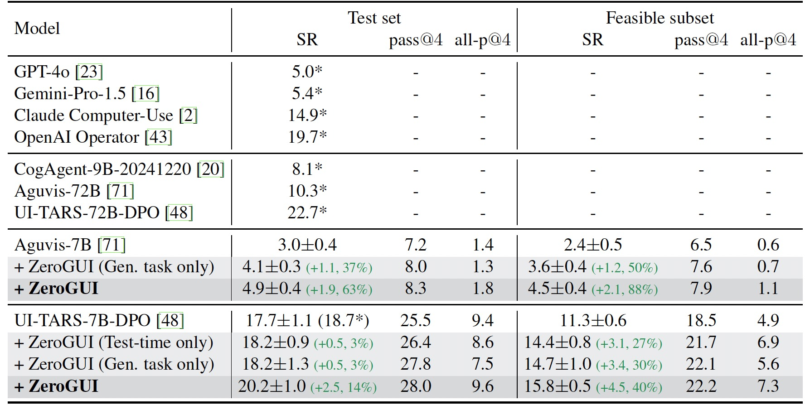

# ZeroGUI: Automating Online GUI Learning at Zero Human Cost

[](https://arxiv.org/abs/2505.23762)
[](https://huggingface.co/collections/OpenGVLab/zerogui-68388cb7dbf608133c4b5fb2)

We propose [**ZeroGUI**](https://arxiv.org/abs/2505.23762), a fully automated online reinforcement learning framework that enables GUI agents to train and adapt in interactive environments at zero human cost.

**🔥 Updates**

- [x] **2025/06/15**: Release the evaluation code and scripts on OSWorld.

- [x] **2025/05/30**: Release the task generation code on OSWorld.

- [x] **2025/05/30**: Release our paper and model checkpoints.

## 🚀 Highlights

* 🚫 **Zero Human Cost:** Requires no handcrafted task annotations or rule-based reward designs.

* 🧠 **VLM-based Automation:** Both training tasks and rewards are generated by powerful VLMs.

* ♻️ **Online Learning:** Agents continuously learn from interacting with GUI environments.

* 📈 **Significant Gains:** +63% (Aguvis) and +14% (UI-TARS) relative improvements on OSWorld.


## 📖 Summary

* 🧠 **Automatic Task Generation:** Automatically proposes diverse, executable GUI tasks.

* ✅ **Automatic Reward Estimation:** Assigns binary task rewards based on trajectory screenshots and employs a voting mechanism to avoid hallucinated success.

* ♻️ **Two-Stage Online RL:** Combines training on generated tasks and test-time adaptation to continually improve agent's performance.


## 📈 Results

### 💻 OSWorld



### 📱 AndroidLab

<div align="center">
    
</div>

## 📦 Checkpoints

| base model | env | 🤗 link |
| :--: | :--: | :--: |
| UI-TARS-7B-DPO | OSWorld | [ZeroGUI-OSWorld-7B](https://huggingface.co/OpenGVLab/ZeroGUI-OSWorld-7B) |
| UI-TARS-7B-DPO | AndroidLab | [ZeroGUI-AndroidLab-7B](https://huggingface.co/OpenGVLab/ZeroGUI-AndroidLab-7B) |

## 🛠️ Usage

### Setup

1. Setup python environment: `pip install -r requirements.txt`. Please use `python>=3.10`.

2. Setup GUI environment: [OSWorld](./osworld/README.md).

### Evaluation

Use the following command to evaluate the model on OSWorld:

```bash
bash scripts/eval/eval_osworld.sh OpenGVLab/ZeroGUI-OSWorld-7B <env-url> <env-manager-port>
```

where `<env-url>` and `<env-manager-port>` are the URL and port of the API manager launched [here](./osworld/env_api_manager.py).

### Training

Based on [OpenRLHF](./openrlhf/), coming soon.

## 📚 Citation

If you find this work helpful in your research, please consider citing:

```bibtex
@article{yang2025zerogui,
  title={ZeroGUI: Automating Online GUI Learning at Zero Human Cost},
  author={Yang, Chenyu and Shiqian, Su and Liu, Shi and Dong, Xuan and Yu, Yue and Su, Weijie and Wang, Xuehui and Liu, Zhaoyang and Zhu, Jinguo and Li, Hao and Wang, Wenhai and Qiao, Yu and Zhu, Xizhou and Dai, Jifeng},
  journal={arXiv preprint arXiv:2505.23762},
  year={2025}
}
```

## Acknowledgements
Our code is built with reference to the code of the following projects: [OpenRLHF](https://github.com/OpenRLHF/OpenRLHF), [UI-TARS](https://github.com/bytedance/UI-TARS), [AGUVIS](https://github.com/xlang-ai/aguvis), [OSWorld](https://github.com/xlang-ai/OSWorld), and [AndroidLab](https://github.com/THUDM/Android-Lab).
