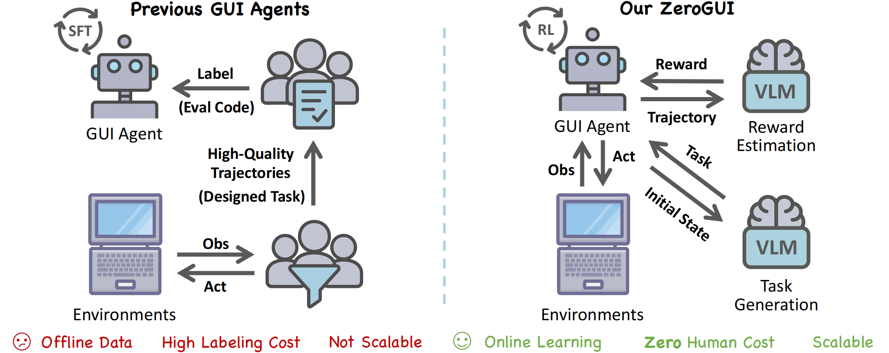
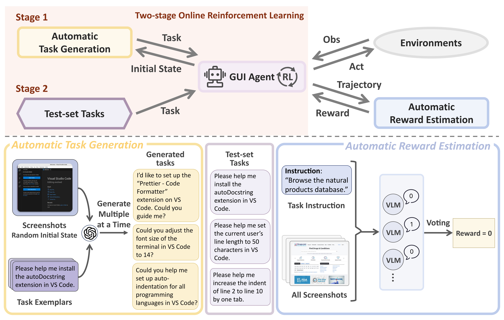

# ZeroGUI: Automating Online GUI Learning at Zero Human Cost

[](https://arxiv.org/abs/2505.23762)
[](https://huggingface.co/collections/OpenGVLab/zerogui-68388cb7dbf608133c4b5fb2)

We propose [**ZeroGUI**](https://arxiv.org/abs/2505.23762), a fully automated online reinforcement learning framework that enables GUI agents to train and adapt in interactive environments at zero human cost.

**🔥 Updates**

- [x] **2025/06/15**: Release the evaluation code and scripts on OSWorld.

- [x] **2025/05/30**: Release the task generation code on OSWorld.

- [x] **2025/05/30**: Release our paper and model checkpoints.

## 🚀 Highlights

* 🚫 **Zero Human Cost:** Requires no handcrafted task annotations or rule-based reward designs.

* 🧠 **VLM-based Automation:** Both training tasks and rewards are generated by powerful VLMs.

* ♻️ **Online Learning:** Agents continuously learn from interacting with GUI environments.

* 📈 **Significant Gains:** +63% (Aguvis) and +14% (UI-TARS) relative improvements on OSWorld.



## 📖 Summary

* 🧠 **Automatic Task Generation:** Automatically proposes diverse, executable GUI tasks.

* ✅ **Automatic Reward Estimation:** Assigns binary task rewards based on trajectory screenshots and employs a voting mechanism to avoid hallucinated success.

* ♻️ **Two-Stage Online RL:** Combines training on generated tasks and test-time adaptation to continually improve agent's performance.



## 📈 Results

### 💻 OSWorld


### 📱 AndroidLab

<div align="center">
    
</div>

## 📦 Checkpoints

| base model | env | 🤗 link |
| :--: | :--: | :--: |
| UI-TARS-7B-DPO | OSWorld | [ZeroGUI-OSWorld-7B](https://huggingface.co/OpenGVLab/ZeroGUI-OSWorld-7B) |
| UI-TARS-7B-DPO | AndroidLab | [ZeroGUI-AndroidLab-7B](https://huggingface.co/OpenGVLab/ZeroGUI-AndroidLab-7B) |

## 🛠️ Usage

### Setup

1. Setup python environment: `pip install -r requirements.txt`. Please use `python>=3.10`.

2. Setup GUI environment: [OSWorld](./osworld/README.md).

### Evaluation

Use the following command to evaluate the model on OSWorld:

```bash
bash scripts/eval/eval_osworld.sh OpenGVLab/ZeroGUI-OSWorld-7B <env-url> <env-manager-port>
```

where `<env-url>` and `<env-manager-port>` are the URL and port of the API manager launched [here](./osworld/env_api_manager.py).

### Training

Before starting training, you need to first refer to the [OSWorld tutorial](https://github.com/OpenGVLab/ZeroGUI/tree/main/osworld#setup) to start the environment server. Then, refer to the [vLLM tutorial](https://docs.vllm.ai/en/latest/serving/openai_compatible_server.html) to start the vLLM server. And pass the server's IP and port information to the execution script.

```bash
# Path of training data
DATA_PATH=./data/osworld_test_all.jsonl

# Path of backbone model
TOKENIZER_PATH=/path/to/model

# env setting
ENV_URL=${ENV_URL:-"http://10.140.52.49"}
ENV_MANAGER_PORT=${ENV_MANAGER_PORT:-10001}
IFS=',' read -ra URL_LIST <<< "$ENV_URL"
NUM_URLS=${#URL_LIST[@]}
# clean all existing remote envs
if [[ $NODE_RANK -eq 0 ]]; then
   for (( i=0; i<$NUM_URLS; i+=1 )) do
      url=${URL_LIST[$i]}
      curl -X POST $url:$ENV_MANAGER_PORT/clean
   done
fi

# node setting
NNODES=${NNODES:-4}
N_ENGINES=${N_ENGINES:-8}
ENGINE_TP=${ENGINE_TP:-4}

# training setting
EPISODE=${EPISODE:-20}
TRAIN_STEP=${TRAIN_STEP:-1000}
RBS=${RBS:-1}
N_SAMPLES=${N_SAMPLES:-64}
R_TARGET_SIZE=${R_TARGET_SIZE:-2048}
TBS=${TBS:-2048} # one update per rollout, TBS = R_TARGET_SIZE
MAX_GEN_BATCH=${MAX_GEN_BATCH:--1}
N_GROUPS=${N_GROUPS:-1}

KL_TYPE=${KL_TYPE:-"mse"}
KL=${KL:-1e-1}
LR=${LR:-2e-6}
LR_SCHEDULE=${LR_SCHEDULE:-"constant_with_warmup"} # constant for ablation
WARMUP=${WARMUP:-0.0}
MAX_LENGTH=${MAX_LENGTH:-512}
export MIN_PIXELS=3136
export MAX_PIXELS=2116800
REWARD_PORT=1278
PY_ARGS=${PY_ARGS:-"--kl_threshold_type=advantage --env_reset_sleep_range=60"}

# llm eval
API_TYPE=${API_TYPE:-"qwen"}
API_MODEL=${API_MODEL:-"Qwen2.5-VL-32B-Instruct"}
API_BASE_URL=${API_BASE_URL:-"http://10.140.37.106:21101"}
API_KEY=${API_KEY:-"empty"}
EVAL_PROMPT_FILE=${EVAL_PROMPT_FILE:-"osworld_llm_eval_v1.json"}

# sampling setting
TEMP=${TEMP:-0.5}
TOP_P=${TOP_P:-0.9}
FREQ_PEN=${FREQ_PEN:-1}

# save & log
EXP_FLAG=${EXP_FLAG:-""}
SAVE_MODEL_NAME=${EXP_FLAG}-kl_${KL_TYPE}_${KL}-rbs_${RBS}-sample_${N_SAMPLES}-rtarget_${R_TARGET_SIZE}-tbs_${TBS}-lr_${LR}-temp_${TEMP}
LOG_BASE=log
mkdir -p results/$SAVE_MODEL_NAME
mkdir -p results/$SAVE_MODEL_NAME/trajectory
MAX_CKPT_NUM=${MAX_CKPT_NUM:-10}

# launch the master node of ray in container
ray start --head --node-ip-address 0.0.0.0 --num-gpus 8

# if you want to launch ray on more nodes, use
ray start --address {MASTER-NODE-ADDRESS}:6379  --num-gpus 8

ray job submit \
   -- python3 -m openrlhf.cli.train_ppo_ray \
   --ref_num_nodes $NNODES \
   --ref_num_gpus_per_node 8 \
   --actor_num_nodes $NNODES \
   --actor_num_gpus_per_node 8 \
   --vllm_num_engines $N_ENGINES \
   --vllm_tensor_parallel_size $ENGINE_TP \
   --enforce_eager \
   --pretrain ${TOKENIZER_PATH} \
   --save_path results/$SAVE_MODEL_NAME \
   --ckpt_path results/$SAVE_MODEL_NAME \
   --micro_train_batch_size 1 \
   --train_batch_size ${TBS} \
   --micro_rollout_batch_size 1 \
   --rollout_batch_size ${RBS} \
   --advantage_estimator group_norm \
   --use_dapo_trainer \
   --dapo_dynamic_sampling \
   --rollout_target_size ${R_TARGET_SIZE} \
   --max_num_gen_batches ${MAX_GEN_BATCH} \
   --max_samples 100000 \
   --max_epochs 1 \
   --num_episodes ${EPISODE} \
   --num_train_steps ${TRAIN_STEP} \
   --lr_warmup_ratio ${WARMUP} \
   --n_samples_per_prompt $N_SAMPLES \
   --prompt_max_len 20480 \
   --generate_max_len $MAX_LENGTH \
   --zero_stage 3 \
   --bf16 \
   --actor_learning_rate $LR \
   --critic_learning_rate 9e-6 \
   --actor_lr_schedule $LR_SCHEDULE \
   --init_kl_coef $KL \
   --kl_loss_coef $KL \
   --kl_penalty_type $KL_TYPE \
   --not_normalize_advantage \
   --prompt_data $DATA_PATH \
   --simple_load_dataset \
   --packing_samples \
   --flash_attn \
   --gradient_checkpointing \
   --save_steps 1 \
   --save_hf_model \
   --wandb_run_name $SAVE_MODEL_NAME \
   --use_tensorboard tb_log \
   --vllm_sync_backend nccl \
   --max_ckpt_num $MAX_CKPT_NUM \
   --group_method normal \
   --use_length_reward_in_efficiency \
   --temperature $TEMP \
   --top_p $TOP_P \
   --frequency_penalty $FREQ_PEN \
   --overlap_comm \
   --train_agent \
   --task_group_distributed \
   --num_distributed_groups $N_GROUPS \
   --data_gather_redistribute \
   --env_type osworld \
   --env_url $ENV_URL \
   --env_manager_port $ENV_MANAGER_PORT \
   --action_space pyautogui \
   --observation_type screenshot \
   --agent_max_steps 15 \
   --save_trajectory \
   --agent_type uitars1_5 \
   --num_history 5 \
   --num_input_image 5 \
   --use_llm_evaluator \
   --api_type $API_TYPE \
   --api_model $API_MODEL \
   --api_base_url $API_BASE_URL \
   --api_key $API_KEY \
   --eval_prompt_file $EVAL_PROMPT_FILE \
   --load_checkpoint \
   --colocate_all_models \
   --vllm_enable_sleep \
   --vllm_gpu_memory_utilization 0.6 \
   --deepspeed_enable_sleep \
   ${PY_ARGS}
```

## 📚 Citation

If you find this work helpful in your research, please consider citing:

```bibtex
@article{yang2025zerogui,
  title={ZeroGUI: Automating Online GUI Learning at Zero Human Cost},
  author={Yang, Chenyu and Shiqian, Su and Liu, Shi and Dong, Xuan and Yu, Yue and Su, Weijie and Wang, Xuehui and Liu, Zhaoyang and Zhu, Jinguo and Li, Hao and Wang, Wenhai and Qiao, Yu and Zhu, Xizhou and Dai, Jifeng},
  journal={arXiv preprint arXiv:2505.23762},
  year={2025}
}
```

## Acknowledgements
Our code is built with reference to the code of the following projects: [OpenRLHF](https://github.com/OpenRLHF/OpenRLHF), [UI-TARS](https://github.com/bytedance/UI-TARS), [AGUVIS](https://github.com/xlang-ai/aguvis), [OSWorld](https://github.com/xlang-ai/OSWorld), and [AndroidLab](https://github.com/THUDM/Android-Lab).
